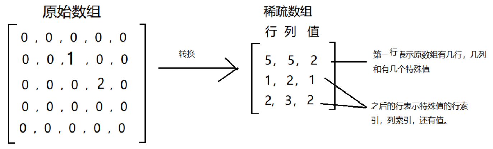

# 稀疏数组

> 基本介绍

当一个数组中大部分元素为0，或者为同一个值的数组时，可以用稀疏数组来保存该数组。

> 稀疏数组的处理方法是

- 记录数组一共有几行几列，有多少个不同的值
- 把具有不同值的元素的行列及值记录在一个小规模数组中，从而缩小程序的规模

> 稀疏数组转换思路的分析

- 二维数组转稀疏数组的思路
- 便利原始的二维数组，得到有效数据的个数sum
- 根据sum就可以创建稀疏数组`Integer sparseArr[][] = new Integer[sum+1][3]`
- 将二维数组的有效数据存入到稀疏数组中

- 稀疏数组转原始的二维数组的思路
- 先读取稀疏数组的第一行，根据第一行的数据，创建原始的二维数组，比如`Integer[11][11] chessArr2`
- 再读取稀疏数组后几行的数据，并赋值给原始的二维数组即可
